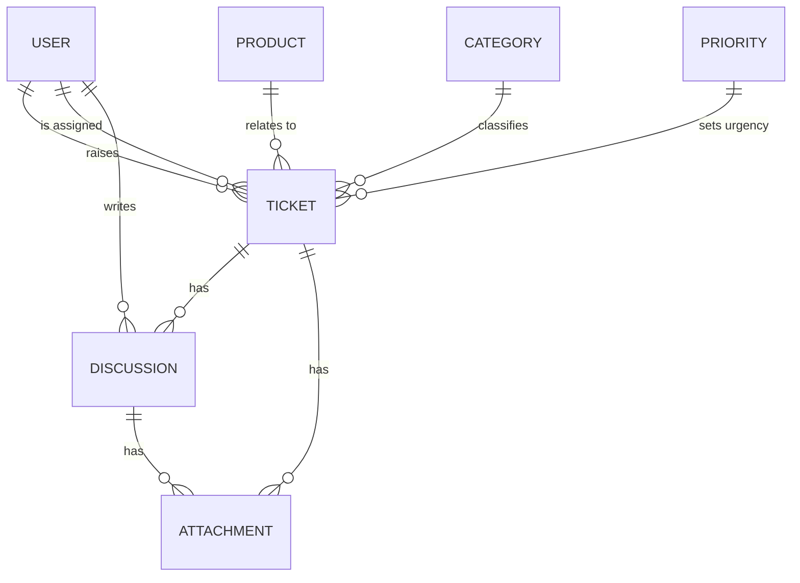

# 🎫 Ticket Management System

A full-stack **support ticketing web application** built with **Blazor Server on .NET 8**. Users raise tickets against products, support staff pick them up, discuss them with file attachments, and close them, while administrators manage user accounts and follow ticket trends on a live dashboard.

The solution is split into three projects (**Domain**, **Infrastructure**, **ClientUI**) so business contracts, data access, and the user interface stay cleanly separated.

<!-- Optional badges: uncomment and adjust once you have CI / a license -->
<!--  -->
<!--  -->

---

## 📑 Table of Contents

- [Overview](#-overview)
- [Features](#-features)
- [Application Pages](#-application-pages)
- [Tech Stack](#-tech-stack)
- [Project Structure](#-project-structure)
- [Architecture](#-architecture)
- [Domain Model](#-domain-model)
- [Ticket Lifecycle](#-ticket-lifecycle)
- [Roles and Permissions](#-roles-and-permissions)
- [Authentication Flow](#-authentication-flow)
- [Services and Repositories](#-services-and-repositories)
- [File Uploads](#-file-uploads)
- [Dashboard and Analytics](#-dashboard-and-analytics)
- [Data Persistence](#-data-persistence)
- [Getting Started](#-getting-started)
- [Configuration](#-configuration)
- [Database Setup and Migrations](#-database-setup-and-migrations)
- [Default Seed Data](#-default-seed-data)
- [Usage](#-usage)
- [Development Commands](#-development-commands)
- [Testing](#-testing)
- [Security](#-security)
- [Known Limitations](#-known-limitations)
- [Roadmap](#-roadmap)
- [Project Goals](#-project-goals)
- [Contributing](#-contributing)
- [License](#-license)
- [Author](#-author)

---

## 📖 Overview

Organisations need a reliable way to log issues, assign them to the right people, and see what has been resolved. **Ticket Management System** provides that workflow end to end:

1. A signed-in user raises a ticket for a **product**, choosing a **category** and **priority**, and assigns it to a colleague.
2. The system calculates an **expected resolution date** from the chosen priority.
3. Everyone involved can **discuss** the ticket and attach supporting files.
4. The ticket moves from **NEW** to **OPEN** to **CLOSED**, and the system records who closed it and when.
5. A dashboard summarises ticket volumes by status, category, product, priority, and month.

---

## ✨ Features

**Ticket management**
- Create tickets with summary, rich-text description, product, category, priority, assignee, and file attachments
- Automatic expected-date calculation based on priority (SLA-style)
- Update product, category, priority, assignee, and status from the ticket details page
- Close tickets, recording the closing user and timestamp
- Overdue highlighting for tickets past their expected date that are not closed
- Friendly ticket references such as `T00042`
- Search by summary and filter by product, category, priority, status, and requester (multi-select)
- Sortable, paged data grid of tickets

**Collaboration**
- Threaded discussion on every ticket
- File attachments on both tickets and discussion messages
- Avatars displayed next to the people who raised or replied to tickets

**Accounts and security**
- Cookie-based authentication using ASP.NET Core Identity
- Role-based access control (**Admin** and **User**)
- Admin-only user management: register users, assign roles, and soft-delete accounts
- New accounts are created with a default password and must change it on first login
- Change-password and avatar upload / reset pages
- Login credentials passed between pages are encrypted (JWE)

**Insights**
- Dashboard with a ticket status summary, a 12-month trend line chart, and a pie chart that can be switched between category, product, and priority

**Engineering**
- Layered architecture with dependency inversion
- Repository and Unit of Work patterns
- Entity Framework Core migrations with seeded reference data
- Typed request / response DTOs with a common `BaseResponse` result wrapper

---

## 🧭 Application Pages

| Route | Access | Description |
| --- | --- | --- |
| `/login` | Public | Sign in with email and password |
| `/processor` | Public | Decrypts the login payload and signs the user in |
| `/logout` | Signed in | Ends the session |
| `/` | Signed in | Dashboard with summary and charts |
| `/ticket` | Signed in | Ticket list with search and filters |
| `/ticket/create` | Signed in | Raise a new ticket |
| `/ticket/details/{ticketId}` | Signed in | View and update a ticket, close it, and read or post discussions |
| `/changepassword` | Signed in | Change your password (required on first login) |
| `/avatar` | Signed in | Upload or reset your profile picture (`.jpg`, `.jpeg`, `.png`) |
| `/user` | **Admin only** | Register users, assign roles, and remove accounts |

> The `/counter` and `/weather` pages come from the default Blazor template and are not part of the ticketing features.

---

## 🧰 Tech Stack

| Layer | Technology |
| --- | --- |
| Language / Runtime | C# 12 / **.NET 8** |
| UI framework | **Blazor Server** (interactive server rendering) |
| Component library | **MudBlazor 8** (data grids, charts, forms) |
| Rich text | **MudExRichTextEditor** |
| Authentication | **ASP.NET Core Identity** with cookie authentication |
| ORM | **Entity Framework Core 8** |
| Database | **Microsoft SQL Server** |
| Token encryption | **jose-jwt** (JWE, A256KW / A256CBC-HS512) |
| Serialization | Newtonsoft.Json |
| Styling | Bootstrap CSS, MudBlazor styles, custom CSS |
| Solution format | `.slnx` |

---

## 📂 Project Structure

```
TicketManagementSystem/
├── ClientUI/                          # Blazor Server web application (presentation layer)
│   ├── Components/
│   │   ├── Layout/                    # MainLayout, NavMenu, AccountPanel, EmptyLayout
│   │   ├── Pages/
│   │   │   ├── Account/               # Login, LoginProcessor, LogOut
│   │   │   ├── Ticket/                # Ticket list, create, details
│   │   │   │   └── Discussion/        # CreateDiscussion, ViewDiscussions
│   │   │   ├── User/                  # User admin, register, change password, avatar
│   │   │   └── Home.razor             # Dashboard
│   │   └── Shared/                    # Reusable Select, MultiSelect, Alert components
│   ├── DTO/                           # UI-only models (LoginDTO, SelectItem)
│   ├── Extensions/                    # Date and value helpers, validation helpers
│   ├── Security/EncryptionHelper.cs   # JWE encode / decode
│   ├── wwwroot/                       # Static assets and uploads
│   ├── appsettings.json
│   └── Program.cs                     # Service registration and pipeline
│
├── Domain/                            # Core contracts, no dependency on other projects
│   ├── Entities/                      # Ticket, User, Product, Category, Priority, Discussion, Attachment
│   ├── DTO/
│   │   ├── Request/                   # CreateTicketRequest, UpdateTicketRequest, GetTicketRequest, ...
│   │   └── Response/                  # GetTicketResponse, DiscussionResponse, ChartResponse, BaseResponse, ...
│   ├── Interfaces/                    # IAccountService, ITicketService, IDiscussionService, ICriteriaService
│   └── Repository/                    # IGenericRepository, ITicketRepository, IDiscussionRepository, IUnitOfWork
│
├── Infrastructure/                    # Implementations of the Domain contracts
│   ├── Common/Constants.cs            # Statuses, roles, default password, default avatar
│   ├── Data/
│   │   ├── AppDBContext.cs            # EF Core / Identity DbContext
│   │   └── migrations/                # EF Core migrations
│   ├── Extensions/Seed.cs             # Seed users, roles, reference data, sample tickets
│   ├── Repository/                    # GenericRepository, TicketRepository, DiscussionRepository, UnitOfWork
│   └── Services/                      # AccountService, TicketService, DiscussionService, CriteriaService
│
├── .gitattributes
├── .gitignore
└── TicketManagementSystem.slnx        # Solution file
```

| Project | Responsibility |
| --- | --- |
| **Domain** | Entities, DTOs, service interfaces, and repository interfaces. |
| **Infrastructure** | EF Core context, migrations, repositories, Unit of Work, and service implementations (business logic). |
| **ClientUI** | Blazor Server UI, authentication setup, dependency injection wiring, encryption helper, and static file storage. |

---

## 🏗 Architecture

```
ClientUI ───► Domain ◄─── Infrastructure
    │                          ▲
    └────── (DI registration) ─┘
```

- **Domain** sits at the centre and knows nothing about the UI or the database.
- **Infrastructure** implements the Domain interfaces.
- **ClientUI** references both projects, but its pages only talk to Domain interfaces (`ITicketService`, `IAccountService`, and so on). Concrete implementations are registered in `Program.cs` through dependency injection.
- Swapping the database or changing how a service works does not require touching the pages.

**Request flow (creating a ticket)**

```
TicketCreate.razor
      │  CreateTicketRequest
      ▼
ITicketService  ──►  TicketService
                        │ resolves current user from HttpContext
                        │ looks up Priority → ExpectedDays → ExpectedDate
                        │ saves attachments to wwwroot/uploads/attachments
                        ▼
                  IUnitOfWork ──► TicketRepository / GenericRepository ──► AppDBContext ──► SQL Server
      ▲
      │  BaseResponse<int> (isSuccess, ErrorMessage, Value = new TicketId)
```

**Dependency injection (from `Program.cs`)**

| Registration | Lifetime |
| --- | --- |
| `IAccountService` → `AccountService` | Scoped |
| `ITicketService` → `TicketService` | Scoped |
| `IDiscussionService` → `DiscussionService` | Scoped |
| `ICriteriaService` → `CriteriaService` | Scoped |
| `IUnitOfWork` → `UnitOfWork` | Scoped |
| `ITicketRepository` → `TicketRepository` | Scoped |
| `IDiscussionRepository` → `DiscussionRepository` | Scoped |
| `EncryptionHelper<T>` | Scoped |
| `AppDBContext` (SQL Server) | Scoped |

---

## 🧩 Domain Model



| Entity | Key fields | Notes |
| --- | --- | --- |
| **Ticket** | `TicketId`, `Summary`, `Description`, `RaisedDate`, `ExpectedDate`, `Status`, `RaisedBy`, `AssignedToId`, `ProductId`, `CategoryId`, `PriorityId`, `ClosedBy`, `ClosedByDate`, `LastUpdatedDate` | Central entity. Status is stored as a string (`NEW`, `OPEN`, `CLOSED`). |
| **User** | Extends `IdentityUser` with `Avatar`, `AccountConfirmed`, `IsDeleted` | `AccountConfirmed` becomes `true` after the first password change. `IsDeleted` implements soft delete. |
| **Product** | `ProductId`, `ProductName` | The product a ticket is about. |
| **Category** | `CategoryId`, `CategoryName` | Type of issue. |
| **Priority** | `PriorityId`, `PriorityName`, `ExpectedDays` | Drives the expected resolution date. |
| **Discussion** | `DiscussionId`, `Message`, `CreatedDate`, `UserId`, `TicketId` | A message posted on a ticket. |
| **Attachment** | `AttachmentId`, `FileName`, `ServerFileName`, `FileSize`, `CreatedDate`, `TicketId?`, `DiscussionId?` | Belongs to either a ticket or a discussion. |

**Reference data**

| Priority | Expected resolution |
| --- | --- |
| Low | 14 days |
| Medium | 7 days |
| High | 1 day |

Seeded categories: *Application Bug*, *Network Issue*, *User Issue*. Seeded products: *Product 1*, *Product 2*, *Product 3*.

---

## 🔄 Ticket Lifecycle

```
   ┌─────┐   assign / triage   ┌──────┐    resolve & close    ┌────────┐
   │ NEW │ ──────────────────► │ OPEN │ ────────────────────► │ CLOSED │
   └─────┘                     └──────┘                       └────────┘
```

1. A ticket is **created** with status `NEW`. The expected date is set to *today + the priority's expected days*.
2. Staff review it, adjust product, category, priority, or assignee, and set it to `OPEN` while work is in progress.
3. When the work is done, the ticket is **closed** (status `CLOSED`). The system stores `ClosedBy` and `ClosedByDate`, and the close button is disabled afterwards.
4. Every update stamps `LastUpdatedDate`.
5. A ticket that passes its expected date without being closed is flagged as **overdue** on the details page.

---

## 🔐 Roles and Permissions

| Capability | User | Admin |
| --- | :---: | :---: |
| Sign in, view dashboard | ✅ | ✅ |
| Create tickets | ✅ | ✅ |
| View, filter, and update tickets | ✅ | ✅ |
| Post discussions and upload attachments | ✅ | ✅ |
| Change own password and avatar | ✅ | ✅ |
| Open the **Users** page | ❌ | ✅ |
| Register new users and assign roles | ❌ | ✅ |
| Remove (soft-delete) users | ❌ | ✅ |

Role checks are enforced with `[Authorize]` / `[Authorize(Roles = "Admin")]` on pages and `<AuthorizeView Roles="Admin">` in the navigation menu.

---

## 🔑 Authentication Flow

1. The user submits the **Login** form.
2. `AccountService.VerifyUser` checks that the account exists, is not deleted, and that the password is correct.
3. The credentials are encrypted into a **JWE token** by `EncryptionHelper` (`A256KW` key wrapping, `A256CBC-HS512` content encryption) and passed to `/processor` as a query parameter.
4. `LoginProcessor` decrypts the payload and calls `SignInManager.PasswordSignInAsync`, which issues the authentication cookie.
5. If the account is not yet confirmed (first login), the user is redirected to `/changepassword`. Otherwise they land on the dashboard.
6. After a successful password change the account is marked as confirmed.

---

## 🧱 Services and Repositories

**Services** (business logic, in `Infrastructure/Services`)

| Service | Responsibilities |
| --- | --- |
| `TicketService` | Create, find, list/filter, and update tickets. Compute expected dates. Save attachments. Provide chart data. |
| `DiscussionService` | Create discussion messages with attachments and list discussions for a ticket. |
| `AccountService` | Register users, verify credentials, get the current user, change password, soft-delete users, upload and reset avatars. |
| `CriteriaService` | Provide dropdown data: categories, products, priorities, and statuses. |

**Repositories** (data access, in `Infrastructure/Repository`)

| Type | Purpose |
| --- | --- |
| `IGenericRepository<T>` / `GenericRepository<T>` | Basic `GetById`, `ListAll`, `Add`, `Update`, `Delete`, `SaveChanges`. |
| `ITicketRepository` / `TicketRepository` | Filtered ticket queries with eager loading, ticket lookup with attachments, and grouped queries for charts. |
| `IDiscussionRepository` / `DiscussionRepository` | Fetch discussions for a ticket. |
| `IUnitOfWork` / `UnitOfWork` | Single entry point to repositories and one `SaveChanges` for the whole operation. |

**DTOs**

- Requests: `CreateTicketRequest`, `UpdateTicketRequest`, `GetTicketRequest` (filters), `CreateDiscussionRequest`, `RegisterUserRequest`, `ChangePasswordRequest`
- Responses: `GetTicketResponse`, `DiscussionResponse`, `GetUserResponse`, `ChartResponse`, and `BaseResponse` / `BaseResponse<T>` (`isSuccess`, `ErrorMessage`, `Value`)

---

## 📎 File Uploads

| Type | Storage location | Naming |
| --- | --- | --- |
| Ticket and discussion attachments | `ClientUI/wwwroot/uploads/attachments/` | `<original-name>-<GUID><ext>` to avoid collisions |
| User avatars | `ClientUI/wwwroot/uploads/avatars/` | `<user-email><ext>` |

The database stores the original file name, the generated server file name, the file size, and the creation date. Avatar uploads accept `.jpg`, `.jpeg`, and `.png`. Users without a custom avatar use `avatar.png`.

---

## 📊 Dashboard and Analytics

The home page presents live data from the database:

- **Status summary**: number of tickets per status (NEW / OPEN / CLOSED)
- **Last 12 months**: line chart of tickets raised per month
- **Breakdown pie chart**: switchable between **category**, **product**, and **priority**

---

## 🗄 Data Persistence

Persistence is isolated in the **Infrastructure** layer. The Domain defines *what* is stored and retrieved, and Infrastructure decides *how*.

- **SQL Server** through **Entity Framework Core 8**
- `AppDBContext` extends `IdentityDbContext<User>`, so Identity tables (users, roles, user roles) live alongside the ticketing tables
- Relationships use `DeleteBehavior.NoAction` for the ticket-to-user and discussion-to-ticket links to avoid multiple cascade paths
- Reference data, an administrator, and sample tickets are seeded through `HasData` in `Seed.cs`
- Users are **soft-deleted** (`IsDeleted = true`) so ticket history stays intact

---

## 🚀 Getting Started

### Prerequisites

- [.NET 8 SDK](https://dotnet.microsoft.com/download/dotnet/8.0) or later (the solution uses the `.slnx` format, so use an up-to-date SDK such as .NET 9+ to open the solution file with the CLI)
- **SQL Server** (LocalDB, SQL Server Express, or a full instance)
- An IDE: Visual Studio 2022 (17.13+) / Visual Studio 2026, JetBrains Rider, or VS Code with the C# Dev Kit
- Git

### Installation

```bash
# 1. Clone the repository
git clone https://github.com/BrianAhuga/TicketManagementSystem.git

# 2. Move into the project folder
cd TicketManagementSystem

# 3. Restore dependencies
dotnet restore TicketManagementSystem.slnx

# 4. Build the solution
dotnet build TicketManagementSystem.slnx
```

### Run the application

Create the database first (see [Database Setup and Migrations](#-database-setup-and-migrations)), then:

```bash
dotnet run --project ClientUI --launch-profile https
```

Default development URLs:

| Profile | URL |
| --- | --- |
| `http` | http://localhost:5277 |
| `https` | https://localhost:7181 |

Or open `TicketManagementSystem.slnx` in your IDE, set **ClientUI** as the startup project, and press **F5**.

---

## ⚙ Configuration

Settings live in `ClientUI/appsettings.json` (override per environment with `appsettings.Development.json`, user secrets, or environment variables).

```json
{
  "ConnectionStrings": {
    "DefaultConnection": "Server=.;Database=TicketManagementDB;Trusted_Connection=true;MultipleActiveResultSets=true;TrustServerCertificate=true;"
  },
  "JWEKey": "<a long, random secret>",
  "AllowedHosts": "*"
}
```

| Setting | Description |
| --- | --- |
| `ConnectionStrings:DefaultConnection` | SQL Server connection string. The default targets a local server using Windows authentication. |
| `JWEKey` | Secret used to encrypt and decrypt the login payload. **Replace it with your own long random value** and keep it out of source control. |
| `DetailedErrors` | Shows detailed Blazor circuit errors. Turn off in production. |
| `Logging:LogLevel` | Logging verbosity. |

**Using user secrets instead of committing values**

```bash
cd ClientUI
dotnet user-secrets init
dotnet user-secrets set "JWEKey" "your-long-random-secret"
dotnet user-secrets set "ConnectionStrings:DefaultConnection" "Server=...;Database=TicketManagementDB;..."
```

> Note: `A256KW` needs a 32-byte (256-bit) key, so make your `JWEKey` at least 32 characters long.

---

## 🗃 Database Setup and Migrations

The application does **not** apply migrations automatically at startup, so create the database once before the first run:

```bash
# Install the EF Core CLI if you don't have it
dotnet tool install --global dotnet-ef

# Create / update the database from the repository root
dotnet ef database update --project Infrastructure --startup-project ClientUI
```

Add a new migration after changing entities:

```bash
dotnet ef migrations add <MigrationName> --project Infrastructure --startup-project ClientUI --output-dir Data/migrations
```

Existing migrations include: initialization, additional entities, seed data, `ClosedBy` tracking, column renames, attachment file-size type, and roles with updated seed data.

---

## 🌱 Default Seed Data

The migrations seed everything needed to try the app straight away:

| Item | Value |
| --- | --- |
| Admin account | `Test@gmail.com` |
| Initial password | `NeedReset%123` |
| Roles | `Admin`, `User` |
| Categories | Application Bug, Network Issue, User Issue |
| Products | Product 1, Product 2, Product 3 |
| Priorities | Low (14 days), Medium (7 days), High (1 day) |
| Sample tickets | 60 tickets in mixed states so the dashboard has data |

New users created by an admin also start with the default password `NeedReset%123` and are forced to choose a new one at first login.

> ⚠️ Change the seeded admin password immediately in any shared or production environment.

---

## 💡 Usage

**As an administrator**
1. Sign in with the seeded admin account and change the password when prompted.
2. Open the **Users** page and register team members, choosing the **Admin** or **User** role.
3. Share the default password with them. They will be asked to change it on first login.

**Raising a ticket**
1. Go to **Tickets → Create**.
2. Enter a summary, describe the issue in the rich-text editor, and pick the product, category, priority, and assignee.
3. Attach any files (screenshots, logs, documents) and submit. The expected date is calculated for you.

**Working a ticket**
1. Use the **Tickets** page to search or filter by summary, product, category, priority, status, or requester.
2. Open a ticket to update its details or change its status to `OPEN`.
3. Post updates and attachments in the **discussion** thread.
4. Click **Close** when it is resolved. The closer and date are recorded.

**Tracking trends**
- Open the **dashboard** to see status totals, monthly volume, and the category / product / priority breakdown.

<!-- Add screenshots here, e.g. -->
<!--  -->
<!--  -->
<!--  -->

---

## 🛠 Development Commands

Run these from the repository root.

```bash
dotnet restore TicketManagementSystem.slnx
```
Restore NuGet packages for every project.

```bash
dotnet build TicketManagementSystem.slnx
```
Compile the whole solution.

```bash
dotnet run --project ClientUI
```
Start the application.

```bash
dotnet watch --project ClientUI
```
Run with hot reload while developing.

```bash
dotnet ef database update --project Infrastructure --startup-project ClientUI
```
Apply pending migrations.

```bash
dotnet format TicketManagementSystem.slnx
```
Apply consistent code formatting.

```bash
dotnet clean TicketManagementSystem.slnx
```
Remove build output.

---

## 🧪 Testing

There is no test project yet. A good starting point:

- `Domain.Tests`: entity and DTO behaviour
- `Infrastructure.Tests`: service logic (expected-date calculation, close-ticket rules) using mocked `IUnitOfWork`, plus repository tests against the EF Core in-memory or SQLite provider

```bash
dotnet test TicketManagementSystem.slnx
```

---

## 🔒 Security

Already in place:

- ASP.NET Core Identity with hashed passwords and cookie authentication
- Role-based authorization on pages and navigation
- Anti-forgery middleware and HTTPS redirection
- HSTS and a generic error page outside Development
- Soft-deleted users cannot sign in
- Uploaded files are stored under a GUID-suffixed name
- Login payload encrypted with JWE

Recommended before deploying:

- Move `JWEKey` and the connection string into user secrets, environment variables, or a secret manager, and rotate the key committed in `appsettings.json`
- Change the seeded admin password and consider generating a unique temporary password per new user instead of one shared default
- Set `DetailedErrors` to `false` in production
- Restrict allowed upload file types and sizes for attachments
- Do not commit files from `wwwroot/uploads` to source control (add them to `.gitignore`)
- Use HTTPS everywhere and restrict `AllowedHosts`

**Never commit private keys, database credentials, or other secrets to GitHub.**

---

## ⚠ Known Limitations

- No automated tests yet
- Migrations must be applied manually
- Ticket statuses are strings (`NEW`, `OPEN`, `CLOSED`) rather than an enum or lookup table
- Uploaded files are stored on the local file system, which does not suit multi-instance or cloud deployments
- Repository methods are synchronous, apart from `SaveChanges`
- No email notifications when a ticket is assigned or updated

---

## 🗺 Roadmap

- [ ] Email / in-app notifications on assignment and status change
- [ ] Unique temporary passwords and a "forgot password" flow
- [ ] Cloud file storage (Azure Blob Storage / S3) for attachments
- [ ] Attachment type and size validation
- [ ] Statuses as an enum or lookup table, plus an `IN PROGRESS` / `RESOLVED` stage
- [ ] Ticket comments editing, deletion, and @mentions
- [ ] SLA breach alerts and escalation
- [ ] Export tickets to CSV / Excel
- [ ] Audit log of ticket changes
- [ ] Unit and integration tests
- [ ] CI pipeline with GitHub Actions
- [ ] Docker support and automatic migrations on startup

---

## 🎯 Project Goals

This project was built to demonstrate practical software engineering concepts, including:

- Layered / clean architecture in .NET
- Blazor Server component development with MudBlazor
- ASP.NET Core Identity, roles, and policy-based page protection
- Entity Framework Core with migrations and seed data
- Repository and Unit of Work patterns
- Dependency injection and programming to abstractions
- Secure handling of credentials and file uploads
- Data visualisation of business metrics

Rather than treating a ticketing tool as simple CRUD, the application combines **authentication, role-based access, SLA-driven dates, collaboration, file handling, and analytics** in a single full-stack system.

---

## 🤝 Contributing

Contributions are welcome!

1. Fork the repository
2. Create a feature branch: `git checkout -b feature/your-feature`
3. Commit your changes: `git commit -m "Add your feature"`
4. Push to the branch: `git push origin feature/your-feature`
5. Open a Pull Request

Please keep changes focused, follow the existing layering (contracts in **Domain**, implementations in **Infrastructure**, UI in **ClientUI**), and add tests where it makes sense.

---

## 📄 License

This project is intended for learning, experimentation, and portfolio demonstration.

---

## 👤 Author

**Brian Ahuga**

Software Engineer specializing in scalable software systems, modern web applications, backend services, and full-stack development.

GitHub: [@BrianAhuga](https://github.com/BrianAhuga)
